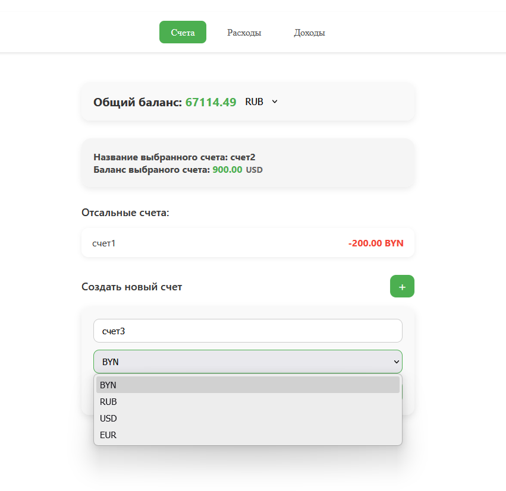
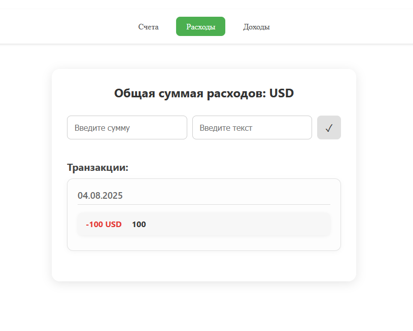
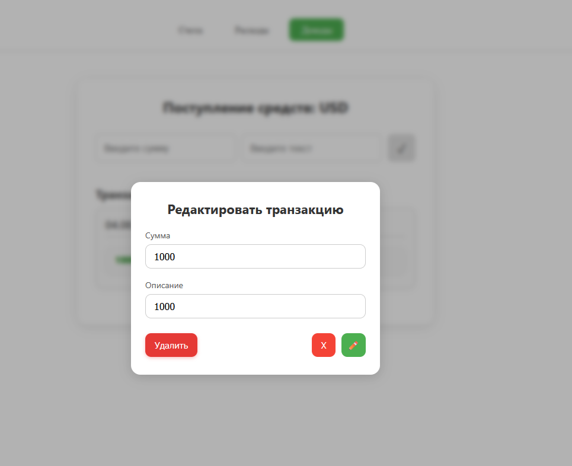

# Financial Tracker (Vue 3 + Pinia)

**Financial Tracker** — это полноценное одностраничное приложение (SPA) для учета личных финансов, разработанное на Vue.js. Проект демонстрирует создание сложного интерактивного интерфейса, управление глобальным состоянием и взаимодействие с внешними API.

**[Посмотреть демо на GitHub Pages](https://ichera.github.io/financial-tracker/)**




## 🚀 Ключевые возможности

*   **Мульти-счета:**
    *   Создание нескольких счетов с указанием названия и валюты (BYN, RUB, USD, EUR).
    *   Отображение актуального баланса для каждого счета и общего баланса по всем счетам.
    *   Возможность редактирования и удаления счетов через модальное окно.
*   **Учет доходов и расходов:**
    *   Раздельные интерфейсы для добавления доходов и расходов с привязкой к конкретному счету.
    *   История операций, сгруппированная по датам для удобного просмотра.
    *   Полный CRUD-функционал: редактирование (сумма, описание) и удаление любой транзакции.
*   **Конвертация валют:**
    *   Отображение общего баланса в выбранной пользователем основной валюте.
    *   Автоматическая загрузка и использование актуальных курсов валют через внешнее API (`ExchangeRate-API`).
*   **Интерактивная навигация:**
    *   Полноценное SPA на `Vue Router` с навигацией между разделами "Счета", "Расходы" и "Доходы" без перезагрузки страницы.
*   **Сохранение данных:**
    *   Все данные (счета, транзакции, выбранный счет и валюта) автоматически сохраняются в `localStorage`, обеспечивая персистентность между сессиями.
*   **Адаптивный дизайн:**
    *   Интерфейс корректно отображается как на десктопных, так и на мобильных устройствах.




## 🛠️ Технологии и архитектура


*   **Vue 3 (Composition API):** Вся логика написана в `<script setup>`.
*   **Pinia:** Используется для централизованного управления состоянием приложения. `Store` разделен на логические модули (`transactions`, `currency`) и активно использует:
    *   **`State`**: `ref` для хранения "сырых" данных — массивов счетов и транзакций.
    *   **`Getters`**: `computed` для предоставления производных, вычисляемых данных (например, `accountsWithBalance`, `totalBalance`, данные по активному счету), которые реактивно обновляются при изменении `state`.
*   **Vue Router:** Обеспечивает клиентскую маршрутизацию, позволяя создавать полноценное SPA с "чистыми" URL-адресами.
*   **Асинхронные операции:** Использование `async/await` и `fetch` для взаимодействия с внешним API курсов валют.
*   **Реактивность и `watch`:** `watch` используется для автоматической синхронизации состояния Pinia store с `localStorage` при любых изменениях.

## ⚙️ Как запустить проект локально

1.  Клонируйте репозиторий:
    ```bash
    git clone https://github.com/iCHera/financial-tracker.git
    ```

2.  Перейдите в папку проекта:
    ```bash
    cd financial-tracker
    ```

3.  Установите зависимости:
    ```bash
    npm install
    ```

4.  Запустите сервер для разработки:
    ```bash
    npm run dev
    ```
